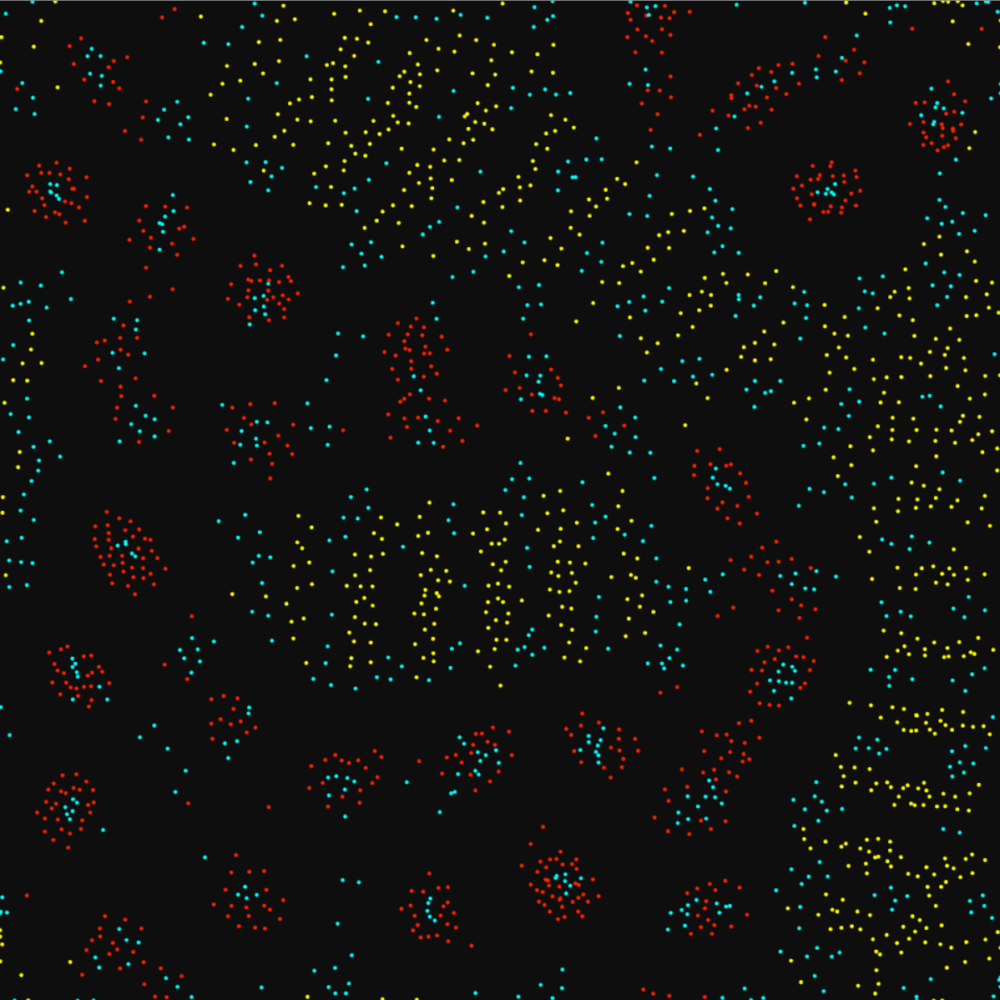
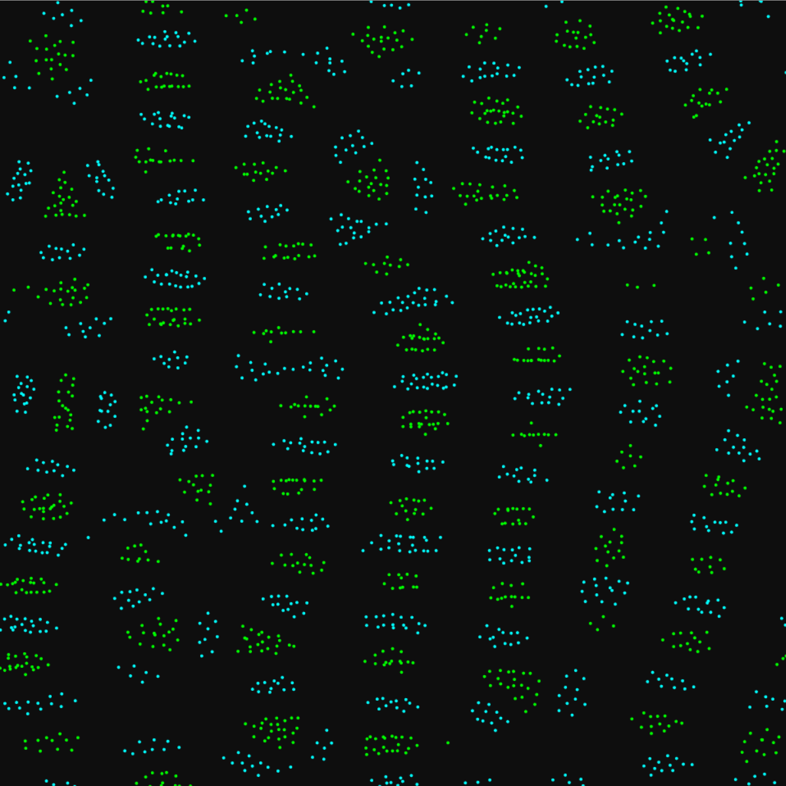
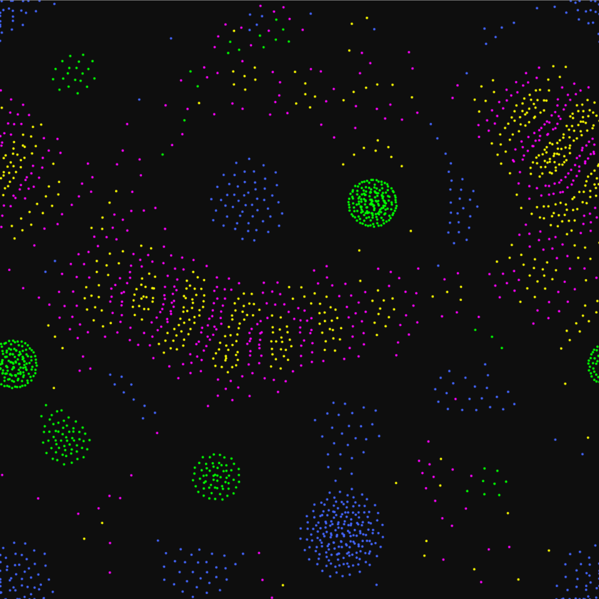
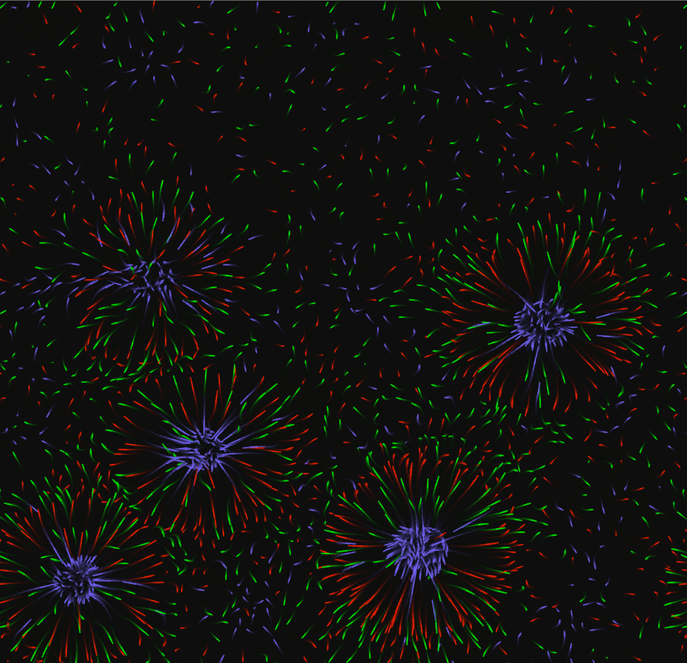

# diffusionlife -- [View Demo](https://harryhinch.github.io/diffusionlife/)

**shortlink: [diffused.life](https://diffused.life/)**

Diffusion life is web toy that simulates attractions & repulsions between particles. The (relatively) simple rules can birth complex patterns that mimic cellular life, crystalline structures, and other abstract phenomena.
Inspired by Tom Mohr's [particle life](https://particle-life.com/) & Jeffrey Ventrella's [clusters](https://ventrella.com/Clusters/).

This mostly follows Tom Mohr's implementation, but I have increased the complexity of the function that maps distance to force for each particle from a 3 points to 6 points (including the start and end). There are now 4 parameters per particle interaction. I've also added lots more sliders, different particle shapes, and an automatic randomizer on an adjustable timer. Written in vanilla javascript.

The algorithm to find nearby particles implements a [QuadTree](https://en.wikipedia.org/wiki/Quadtree) in [toroidal space](https://blog.demofox.org/2017/10/01/calculating-the-distance-between-points-in-wrap-around-toroidal-space/) to allow screen wrapping.

## Examples

## Roadmap
- ~~Improve performance with better, cleaner algorithm~~ ✔
- --Allow modifying a function parameter-- ✔
- --Color Mapping-- ✔ 
- Color Palettes
- Saving and loading simulations
- Add Audio?
- Use Web Assembly for better performance?